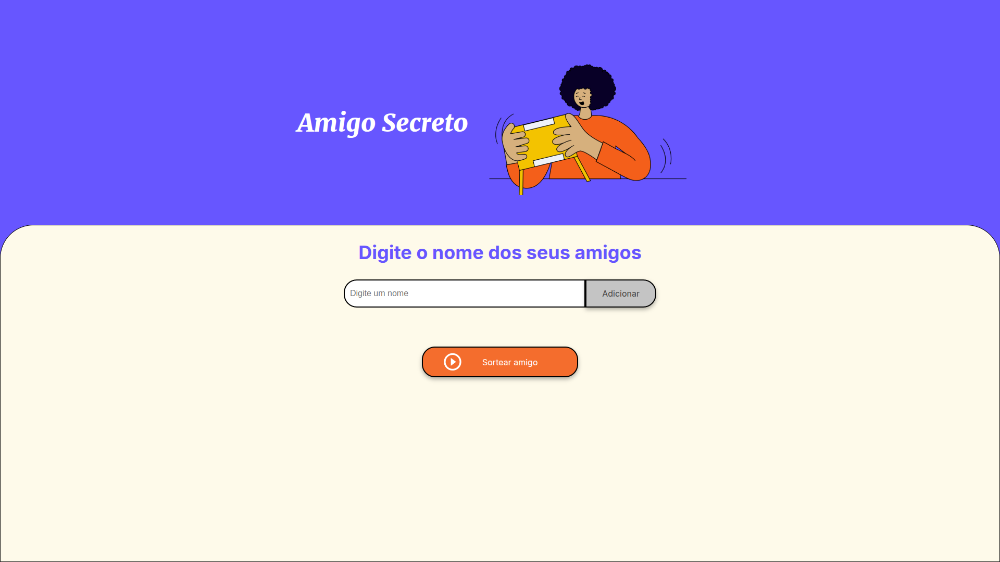
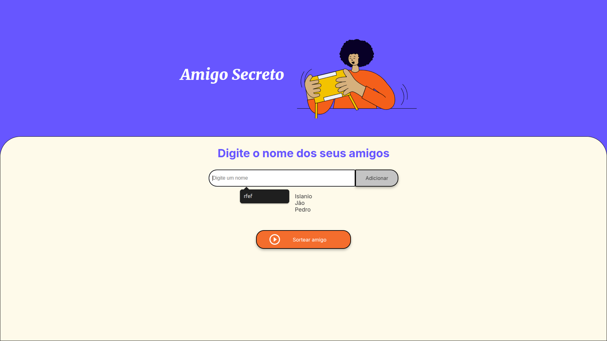
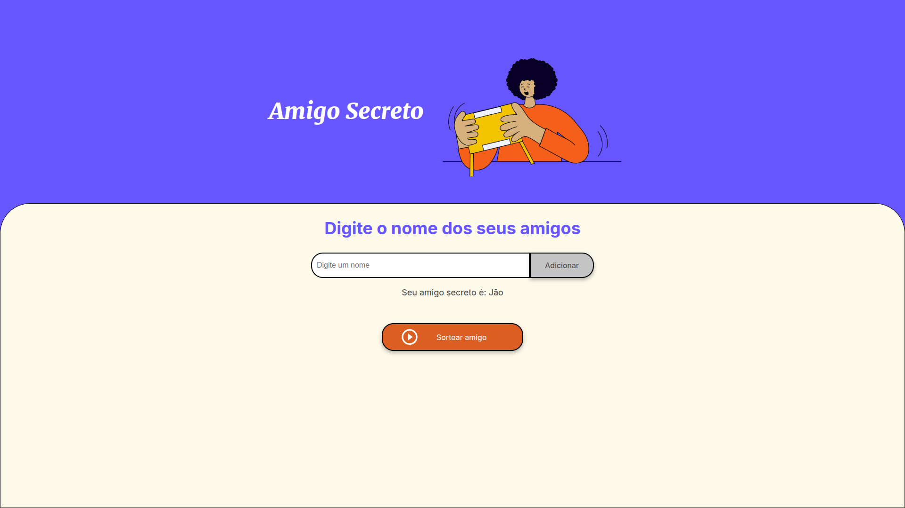

# Amigo Secreto

Este é um projeto para organizar e gerenciar um amigo secreto. O objetivo é facilitar a criação e o sorteio dos participantes, além de permitir a visualização dos resultados de forma simples e intuitiva.

## Funcionalidades

- Cadastro de participantes
- Sorteio automático dos amigos secretos
- Envio de notificações por e-mail
- Visualização dos resultados

## Como usar

1. Clone o repositório:
    
    git clone https://github.com/seu-usuario/amigo-secreto.git
    
2. Navegue até o diretório do projeto:
    
    cd amigo-secreto
    
3. Instale as dependências:
    
    npm install
    
4. Inicie o projeto:
    
    npm start

## Imagem do projeto

